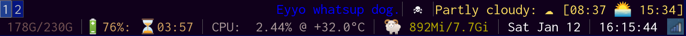

# i3blocks-config
This is my i3blocks configuration. It might require some extra packeages to be installed.

***
<h2> Modification: </h2>
It is easy to modify the bar. Take a look at [./config/i3blocks/config](.config/i3blocks/config) and
see for yourself how easy it is to modify the bar. If something is not working, this should be the 
entypoint for your bug searching. I have not tested any this on any other computer, it will probably break
and i leave you to fix it for yourself. Heeh.
   
If you want to modify the weather location data, take a look into [.config/i3blocks/weather/weather.py](.config/i3blocks/weather/weather.py).
This to is easy to modify, just change the YR.no XML link.

***
<h3>Thumbnail:</h3>

 
 

***

<h2>Requiered software and packages.</h2>

* [I3BLOCKS](https://www.archlinux.org/packages/community/x86_64/i3blocks/): The actuall bar.
* [NOTO-FONTS-EMOJI](https://www.archlinux.org/packages/extra/any/noto-fonts-emoji/): Or other emojicon font.
* [DUNST](https://www.archlinux.org/packages/community/x86_64/dunst/): Or other notification daemon.
* [ACPI](https://www.archlinux.org/packages/community/x86_64/acpi/): For getting battery information.
* [CPU-STAT](https://github.com/vivaladav/cpu-stat): For getting CPU usage. This should be manually installed and the executable should be runable from '.config/i3blocks/cpu/cpu-stat'.
* [CURL](https://www.archlinux.org/packages/core/x86_64/curl/): Probably already installed.
* [PYTHON 3](https://www.archlinux.org/packages/extra/x86_64/python/): Probably already installed.
